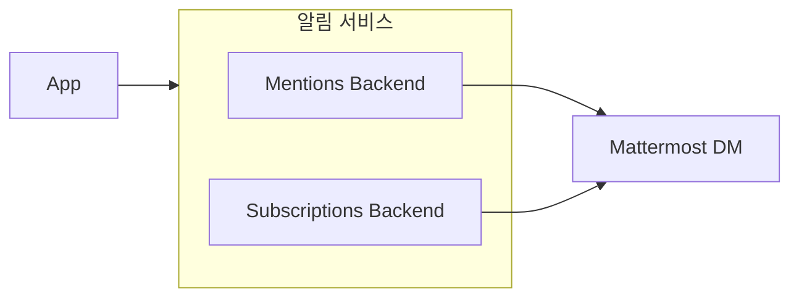

# 사용자 요구사항 대비 구현 방안

이 문서는 [Mattermost 공식 문서](https://docs.mattermost.com/)를 참고하여 Mattermost Boards 플러그인의 사용자 요구사항과 구현 방안을 정리합니다.

---

## 목차

1. [프로젝트 개요](#1-프로젝트-개요)
2. [핵심 기능 요구사항](#2-핵심-기능-요구사항)
3. [Mattermost 플랫폼 연동 요구사항](#3-mattermost-플랫폼-연동-요구사항)
4. [보안 및 권한 요구사항](#4-보안-및-권한-요구사항)
5. [성능 및 확장성 요구사항](#5-성능-및-확장성-요구사항)
6. [배포 및 운영 요구사항](#6-배포-및-운영-요구사항)
7. [구현 우선순위 및 로드맵](#7-구현-우선순위-및-로드맵)

---

## 1. 프로젝트 개요

### 1.1 프로젝트 목적

Mattermost Boards 플러그인은 Mattermost 내에서 **프로젝트 및 작업 관리** 기능을 제공하는 통합 솔루션입니다. Trello, Notion, Asana의 대안으로서 Kanban 보드, 테이블, 캘린더 뷰 등 다양한 시각화 도구를 지원합니다.

> 참고: [Mattermost Project and Task Management](https://docs.mattermost.com/)

### 1.2 대상 사용자

| 사용자 유형 | 주요 요구사항 |
|------------|--------------|
| 프로젝트 매니저 | 작업 추적, 마일스톤 관리, 리포팅 |
| 개발자 | 스프린트 관리, 이슈 트래킹, DevSecOps 통합 |
| 팀원 | 개인 작업 관리, 협업, 알림 |
| 관리자 | 권한 설정, 데이터 관리, 규정 준수 |

---

## 2. 핵심 기능 요구사항

### 2.1 보드 관리

| 요구사항 ID | 요구사항 | 구현 상태 | 구현 방안 |
|------------|---------|----------|----------|
| REQ-BD-001 | 보드 생성/수정/삭제 | ✅ 완료 | `server/api/boards.go`, `server/app/boards.go` |
| REQ-BD-002 | 보드 타입 (Open/Private) | ✅ 완료 | `model.BoardType` 활용 |
| REQ-BD-003 | 보드 복제 | ✅ 완료 | `POST /api/v2/boards/{boardId}/duplicate` |
| REQ-BD-004 | 보드 템플릿 | ✅ 완료 | `isTemplate` 플래그 활용 |
| REQ-BD-005 | 보드 아카이브 내보내기/가져오기 | ✅ 완료 | `server/api/archive.go` |

**구현 세부사항:**

```
server/
├── api/boards.go      # REST API 핸들러
├── app/boards.go      # 비즈니스 로직
├── model/board.go     # 도메인 모델
└── services/store/sqlstore/board.go  # 데이터 접근
```

### 2.2 카드 관리

| 요구사항 ID | 요구사항 | 구현 상태 | 구현 방안 |
|------------|---------|----------|----------|
| REQ-CD-001 | 카드 생성/수정/삭제 | ✅ 완료 | `server/api/cards.go` |
| REQ-CD-002 | 카드 속성 (프로퍼티) | ✅ 완료 | `cardProperties` 필드 |
| REQ-CD-003 | 카드 상세 에디터 | 🔧 개선중 | BlockSuite 에디터 통합 |
| REQ-CD-004 | 카드 첨부파일 | ✅ 완료 | `server/api/files.go` |
| REQ-CD-005 | 카드 댓글 | ✅ 완료 | 블록 타입으로 구현 |
| REQ-CD-006 | 카드 @멘션 | ✅ 완료 | `server/services/notify/` |

**카드 에디터 개선 (REQ-CD-003):**

현재 BlockSuite 에디터를 통합 중이며, 관련 API는 [editor-api.md](editor-api.md)에 문서화되어 있습니다.

```
webapp/src/
├── components/cardDetail/     # 카드 상세 UI
├── blocks/                    # 블록 타입 정의
└── properties/                # 프로퍼티 타입 정의
```

### 2.3 뷰 관리

| 요구사항 ID | 요구사항 | 구현 상태 | 구현 방안 |
|------------|---------|----------|----------|
| REQ-VW-001 | Kanban 보드 뷰 | ✅ 완료 | `webapp/src/components/kanban/` |
| REQ-VW-002 | 테이블 뷰 | ✅ 완료 | `webapp/src/components/table/` |
| REQ-VW-003 | 캘린더 뷰 | ✅ 완료 | `webapp/src/components/calendar/` |
| REQ-VW-004 | 갤러리 뷰 | ✅ 완료 | `webapp/src/components/gallery/` |
| REQ-VW-005 | 뷰 필터링/정렬 | ✅ 완료 | `webapp/src/cardFilter.ts` |
| REQ-VW-006 | 뷰 그룹핑 | ✅ 완료 | `fields.groupById` 활용 |

---

## 3. Mattermost 플랫폼 연동 요구사항

> 참고: [Mattermost Integrations Guide](https://docs.mattermost.com/)

### 3.1 채널 연동

| 요구사항 ID | 요구사항 | 구현 상태 | 구현 방안 |
|------------|---------|----------|----------|
| REQ-CH-001 | 채널에서 보드 생성 | ✅ 완료 | `channelId` 필드 연동 |
| REQ-CH-002 | 채널 RHS 패널 | ✅ 완료 | `webapp/src/components/rhsChannelBoards.tsx` |
| REQ-CH-003 | 채널 헤더 버튼 | ✅ 완료 | 플러그인 API 활용 |

**구현 방안:**

```typescript
// webapp/src/components/rhsChannelBoards.tsx
// Mattermost 채널 RHS에 보드 목록 표시
```

### 3.2 메시지 연동

| 요구사항 ID | 요구사항 | 구현 상태 | 구현 방안 |
|------------|---------|----------|----------|
| REQ-MS-001 | 보드 링크 미리보기 (Unfurl) | ✅ 완료 | `webapp/src/components/boardsUnfurl/` |
| REQ-MS-002 | 메시지에 보드 삽입 | ✅ 완료 | `BoardsEmbed` 구조체 |
| REQ-MS-003 | 슬래시 명령어 | ⏳ 계획 | `/boards` 명령어 구현 예정 |

**Unfurl 구현 (`server/boards/post.go`):**

```go
type BoardsEmbed struct {
    OriginalPath string `json:"originalPath"`
    TeamID       string `json:"teamID"`
    ViewID       string `json:"viewID"`
    BoardID      string `json:"boardID"`
    CardID       string `json:"cardID"`
    ReadToken    string `json:"readToken,omitempty"`
}
```

### 3.3 알림 연동

| 요구사항 ID | 요구사항 | 구현 상태 | 구현 방안 |
|------------|---------|----------|----------|
| REQ-NT-001 | @멘션 알림 | ✅ 완료 | `server/services/notify/notifymentions/` |
| REQ-NT-002 | 구독 알림 | ✅ 완료 | `server/services/notify/notifysubscriptions/` |
| REQ-NT-003 | DM 알림 | ✅ 완료 | Mattermost DM API 활용 |
| REQ-NT-004 | 이메일 알림 | ⏳ 계획 | Mattermost 이메일 서비스 연동 |

**알림 아키텍처:**



### 3.4 실시간 동기화

| 요구사항 ID | 요구사항 | 구현 상태 | 구현 방안 |
|------------|---------|----------|----------|
| REQ-WS-001 | 보드 변경 실시간 반영 | ✅ 완료 | WebSocket Plugin Adapter |
| REQ-WS-002 | 카드 변경 실시간 반영 | ✅ 완료 | `ACTION_UPDATE_BLOCK` |
| REQ-WS-003 | 멤버 변경 실시간 반영 | ✅ 완료 | `ACTION_UPDATE_MEMBER` |
| REQ-WS-004 | 클러스터 환경 지원 | ✅ 완료 | `OnPluginClusterEvent` |

**WebSocket 이벤트 타입 (`webapp/src/wsclient.ts`):**

```typescript
export const ACTION_UPDATE_BOARD = 'UPDATE_BOARD'
export const ACTION_UPDATE_MEMBER = 'UPDATE_MEMBER'
export const ACTION_UPDATE_BLOCK = 'UPDATE_BLOCK'
export const ACTION_UPDATE_CATEGORY = 'UPDATE_CATEGORY'
```

---

## 4. 보안 및 권한 요구사항

> 참고: [Mattermost Security Guide](https://docs.mattermost.com/)

### 4.1 인증

| 요구사항 ID | 요구사항 | 구현 상태 | 구현 방안 |
|------------|---------|----------|----------|
| REQ-AU-001 | Mattermost SSO 연동 | ✅ 완료 | Plugin Session API |
| REQ-AU-002 | CSRF 토큰 검증 | ✅ 완료 | `X-Requested-With` 헤더 |
| REQ-AU-003 | 공개 공유 토큰 | ✅ 완료 | `read_token` 파라미터 |

### 4.2 권한 체계

| 요구사항 ID | 요구사항 | 구현 상태 | 구현 방안 |
|------------|---------|----------|----------|
| REQ-PM-001 | 보드 역할 (Admin/Editor/Commenter/Viewer) | ✅ 완료 | `BoardRole` 타입 |
| REQ-PM-002 | Mattermost 권한 통합 | ✅ 완료 | `server/services/permissions/mmpermissions/` |
| REQ-PM-003 | 팀 기반 접근 제어 | ✅ 완료 | `teamId` 필드 검증 |
| REQ-PM-004 | 게스트 사용자 제한 | ✅ 완료 | `UserIsGuest` 검사 |

**역할 계층:**

| 역할 | 읽기 | 댓글 | 편집 | 관리 |
|------|------|------|------|------|
| Viewer | ✅ | ❌ | ❌ | ❌ |
| Commenter | ✅ | ✅ | ❌ | ❌ |
| Editor | ✅ | ✅ | ✅ | ❌ |
| Admin | ✅ | ✅ | ✅ | ✅ |

### 4.3 데이터 보호

| 요구사항 ID | 요구사항 | 구현 상태 | 구현 방안 |
|------------|---------|----------|----------|
| REQ-DP-001 | 데이터 보존 정책 | ✅ 완료 | `server/boards/data_retention.go` |
| REQ-DP-002 | 규정 준수 (Compliance) | ✅ 완료 | `server/api/compliance.go` |
| REQ-DP-003 | 감사 로그 | ✅ 완료 | `server/services/audit/` |
| REQ-DP-004 | 파일 암호화 | ⏳ 계획 | Mattermost 암호화 서비스 연동 |

---

## 5. 성능 및 확장성 요구사항

> 참고: [Mattermost Scaling Architecture](https://docs.mattermost.com/)

### 5.1 성능 최적화

| 요구사항 ID | 요구사항 | 구현 상태 | 구현 방안 |
|------------|---------|----------|----------|
| REQ-PF-001 | 대용량 보드 로딩 최적화 | 🔧 개선중 | 페이지네이션, 가상 스크롤 |
| REQ-PF-002 | 블록 캐싱 | ⏳ 계획 | Redis 캐시 레이어 |
| REQ-PF-003 | 이미지 최적화 | ✅ 완료 | 썸네일/미리보기 생성 |
| REQ-PF-004 | 검색 최적화 | ⏳ 계획 | Elasticsearch 연동 |

**성능 개선 방안:**

```go
// 대용량 보드 페이지네이션
type QueryBlocksOptions struct {
    BoardID  string
    ParentID string
    BlockType string
    Page     int
    PerPage  int
}
```

### 5.2 확장성

| 요구사항 ID | 요구사항 | 구현 상태 | 구현 방안 |
|------------|---------|----------|----------|
| REQ-SC-001 | 고가용성 (HA) 지원 | ✅ 완료 | 클러스터 이벤트 동기화 |
| REQ-SC-002 | 멀티 데이터베이스 지원 | ✅ 완료 | PostgreSQL, MySQL, SQLite |
| REQ-SC-003 | 수평 확장 | ✅ 완료 | Stateless 서버 설계 |

---

## 6. 배포 및 운영 요구사항

> 참고: [Mattermost Deployment Guide](https://docs.mattermost.com/)

### 6.1 배포

| 요구사항 ID | 요구사항 | 구현 상태 | 구현 방안 |
|------------|---------|----------|----------|
| REQ-DP-001 | 플러그인 마켓플레이스 배포 | ✅ 완료 | `.tar.gz` 패키징 |
| REQ-DP-002 | 멀티 아키텍처 지원 | ✅ 완료 | linux/darwin amd64/arm64 |
| REQ-DP-003 | 도커 지원 | ✅ 완료 | Mattermost 도커 이미지 호환 |
| REQ-DP-004 | Kubernetes 지원 | ✅ 완료 | Helm 차트 호환 |

**배포 명령:**

```bash
# 프로덕션 빌드
make dist

# 로컬 배포
make deploy

# 실시간 개발
make watch-plugin
```

### 6.2 모니터링

| 요구사항 ID | 요구사항 | 구현 상태 | 구현 방안 |
|------------|---------|----------|----------|
| REQ-MN-001 | Prometheus 메트릭 | ✅ 완료 | `server/services/metrics/` |
| REQ-MN-002 | 로그 수집 | ✅ 완료 | `mlog` 라이브러리 |
| REQ-MN-003 | 지원 패킷 생성 | ✅ 완료 | `GenerateSupportData` |
| REQ-MN-004 | 헬스 체크 | ✅ 완료 | `/api/v2/system/ping` |

**메트릭 예시:**

| 메트릭 | 설명 |
|--------|------|
| `focalboard_blocks_total` | 총 블록 수 |
| `focalboard_boards_total` | 총 보드 수 |
| `focalboard_api_requests_total` | API 요청 수 |

### 6.3 설정 관리

| 요구사항 ID | 요구사항 | 구현 상태 | 구현 방안 |
|------------|---------|----------|----------|
| REQ-CF-001 | System Console 설정 | ✅ 완료 | `plugin.json` settings_schema |
| REQ-CF-002 | 환경 변수 오버라이드 | ✅ 완료 | `FOCALBOARD_*` 접두사 |
| REQ-CF-003 | 기능 플래그 | ✅ 완료 | `FeatureFlags` 맵 |

---

## 7. 구현 우선순위 및 로드맵

### 7.1 Phase 1: 핵심 기능 안정화 (현재)

| 우선순위 | 작업 | 상태 | 담당 |
|---------|------|------|------|
| P0 | BlockSuite 에디터 통합 완료 | 🔧 진행중 | - |
| P0 | 기존 API 안정성 테스트 | 🔧 진행중 | - |
| P1 | 성능 최적화 (대용량 보드) | ⏳ 계획 | - |
| P1 | 에러 핸들링 개선 | ⏳ 계획 | - |

### 7.2 Phase 2: 플랫폼 연동 강화

| 우선순위 | 작업 | 상태 | 예상 완료 |
|---------|------|------|----------|
| P1 | 슬래시 명령어 `/boards` | ⏳ 계획 | Q1 |
| P1 | 이메일 알림 | ⏳ 계획 | Q1 |
| P2 | Playbooks 연동 | ⏳ 계획 | Q2 |
| P2 | AI Agents 연동 | ⏳ 계획 | Q2 |

### 7.3 Phase 3: 엔터프라이즈 기능

| 우선순위 | 작업 | 상태 | 예상 완료 |
|---------|------|------|----------|
| P2 | Elasticsearch 검색 | ⏳ 계획 | Q2 |
| P2 | Redis 캐싱 | ⏳ 계획 | Q2 |
| P3 | 고급 권한 관리 | ⏳ 계획 | Q3 |
| P3 | 외부 시스템 연동 (Jira, GitHub) | ⏳ 계획 | Q3 |

---

## 8. 미구현 기능 구현 방안

### 8.1 슬래시 명령어 구현

**요구사항:** `/boards` 명령어로 빠른 보드 접근

**구현 방안:**

```go
// server/plugin.go
func (p *Plugin) ExecuteCommand(c *plugin.Context, args *model.CommandArgs) (*model.CommandResponse, string) {
    switch args.Command {
    case "/boards":
        return p.handleBoardsCommand(args)
    case "/boards create":
        return p.handleCreateBoardCommand(args)
    case "/boards search":
        return p.handleSearchBoardCommand(args)
    }
}

func (p *Plugin) OnActivate() error {
    // 명령어 등록
    p.API.RegisterCommand(&model.Command{
        Trigger:          "boards",
        AutoComplete:     true,
        AutoCompleteDesc: "Boards 관련 명령어",
    })
}
```

### 8.2 이메일 알림 구현

**요구사항:** 중요 변경 사항 이메일 알림

**구현 방안:**

```go
// server/services/notify/notifyemail/email.go
type EmailNotifyBackend struct {
    servicesAPI model.ServicesAPI
    logger      mlog.LoggerIFace
}

func (b *EmailNotifyBackend) NotifyCardChange(card *model.Card, changes []Change) error {
    // Mattermost 이메일 서비스 활용
    return b.servicesAPI.SendMail(recipient, subject, body)
}
```

### 8.3 AI Agents 연동

**요구사항:** Mattermost AI Agents와 통합

> 참고: [Mattermost AI Agents](https://docs.mattermost.com/)

**구현 방안:**

```go
// server/api/ai.go
func (a *API) registerAIRoutes(r *mux.Router) {
    r.HandleFunc("/boards/{boardID}/ai/suggest", a.handleAISuggest).Methods("POST")
    r.HandleFunc("/cards/{cardID}/ai/summarize", a.handleAISummarize).Methods("POST")
}

// AI 기능 예시
// - 카드 설명 자동 생성
// - 작업 우선순위 제안
// - 유사 카드 검색
```

---

## 9. 기술 부채 및 개선 사항

### 9.1 코드 품질

| 항목 | 현재 상태 | 목표 | 개선 방안 |
|------|----------|------|----------|
| 테스트 커버리지 | ~60% | 80% | 통합 테스트 추가 |
| 린트 경고 | 존재 | 0 | `golangci-lint` 설정 강화 |
| 문서화 | 부분적 | 완료 | API 문서 자동 생성 |

### 9.2 아키텍처 개선

| 항목 | 현재 상태 | 목표 | 개선 방안 |
|------|----------|------|----------|
| API 버전 | v2 | v3 | 점진적 마이그레이션 |
| 에러 처리 | 기본 | 구조화 | 에러 코드 체계화 |
| 로깅 | 기본 | 구조화 | 컨텍스트 로깅 |

---

## 참고 자료

- [Mattermost 공식 문서](https://docs.mattermost.com/)
- [Mattermost Plugin 개발 가이드](https://developers.mattermost.com/integrate/plugins/)
- [Mattermost REST API Reference](https://api.mattermost.com/)
- [프로젝트 아키텍처 문서](architecture.md)
- [에디터 API 문서](editor-api.md)

---

## 변경 이력

| 버전 | 날짜 | 작성자 | 변경 내용 |
|------|------|--------|----------|
| 1.0 | 2026-01-04 | - | 최초 작성 |

